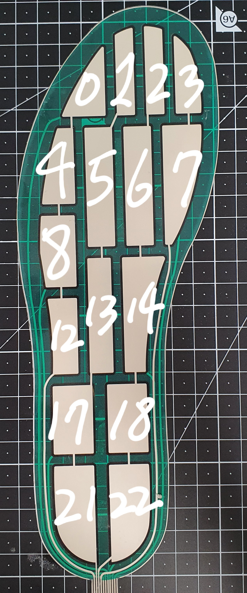

# Specification
## 1. 발바닥압력 -> 몸뼈대
### 1.1. 데이터 위치
skeleton_data 경로내에 있으며 계속 걷는 데이터(skeleton_keep_walk.csv) 걸었다가 멈추는 데이터(skeleton_stop_walk_repeat.csv)가 있습니다.

### 1.2. 데이터 헤더설명

인솔 센서의 header 정보는 <side>.<sensor_type>.<index> 로 구성되어 있습니다.
csv_count,
time,
left.insoleId,


### skel positions
[index]\_[axis(xyzuvw)]
x, y, z 는 joint의 시작점,
u, v, w,는 joint의 벡터입니다.


0_x,0_y,0_z,0_u,0_v,0_w,1_x,1_y,1_z,1_u,1_v,1_w,2_x,2_y,2_z,2_u,2_v,2_w,3_x,3_y,3_z,3_u,3_v,3_w,4_x,4_y,4_z,4_u,4_v,4_w,5_x,5_y,5_z,5_u,5_v,5_w,6_x,6_y,6_z,6_u,6_v,6_w,7_x,7_y,7_z,7_u,7_v,7_w,8_x,8_y,8_z,8_u,8_v,8_w,9_x,9_y,9_z,9_u,9_v,9_w,10_x,10_y,10_z,10_u,10_v,10_w,11_x,11_y,11_z,11_u,11_v,11_w,12_x,12_y,12_z,12_u,12_v,12_w,13_x,13_y,13_z,13_u,13_v,13_w,14_x,14_y,14_z,14_u,14_v,14_w,15_x,15_y,15_z,15_u,15_v,15_w,16_x,16_y,16_z,16_u,16_v,16_w


## Skel 번호별 위치
0. 'head_top'
1. 'neck'
2. 'right_shoulder'
3. 'right_elbow' 
4. 'right_wrist',
5. 'left_shoulder'
6. 'left_elbow'
7. 'left_wrist'
8. 'right_hip'
9. 'right_knee'
10. 'right_ankle', 
11. 'left_hip', 
12. 'left_knee'
13. 'left_ankle'


## 압력센서 번호별 위치



### 1.3. 결과물 재생하는 법

```python skel_viewer.py -s skeleton_keep_walk.csv(default)```


